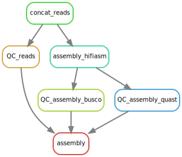

<style>
blue { color: blue }
yellow { color: yellow }
</style>

# Pipeline Assemblage Asselidae Pacbio(hifiasm)
## Short description
<blue>**{ARG}**</blue> --> argument from the config.yaml or the one you give in your comment see run the pipeline section
## Dependancies
- conda
- snakemake

## Input
### Pacbio Long-reads 
The reads should be reunited in a folder and have to be gzipped (fastq.gz) like:
    long_reads_folder
    ├── 01022023.fastq.gz
    ├── fastq_runid_ca9af3b5ba9ac03d97b156b20e01b9f569911a7f_44_0.fastq.gz
    └── fastq_runid_gyfgidgfilga9ac03d97b156b20e01b9f569911a7f_12_0.fastq.gz

You need to give the fullpath to "long_reads_folder" like : /beegfs/data/gdebaecker/Proasellus_coiffaiti/pacbio_fastq/


## Run the pipeline 

### exemple 
```
#!/bin/bash
#SBATCH --partition=normal
#SBATCH --nodes=1
#SBATCH --cpus-per-task=16
#SBATCH --time=168:00:00
#SBATCH --mem=300G
#SBATCH --output=/beegfs/home/gdebaecker/out_error/pipeline_hifiasm.out
#SBATCH --error=/beegfs/home/gdebaecker/out_error/pipeline_hifiasm.e
#SBATCH --job-name=pipeline_hifiasm
#SBATCH --mail-type=ALL
#SBATCH --mail-user='gautier.debaecker@univ-lyon1.fr'

source /beegfs/data/soft/bioconda/etc/profile.d/conda.sh
cd /beegfs/project/nega/script_pipeline_gautier/pipeline_pacbio_hifiasm/
FASTQ=/beegfs/data/gdebaecker/Proasellus_coiffaiti/pacbio_reads/test_pipeline
OUTDIR=/beegfs/project/nega/assembly/pipeline_hifiasm

snakemake assembly --use-conda -j 16 -C reads_folder=$FASTQ out_dir=$OUTDIR asm_name="test_proasellus_coiffaiti_hifiasm" busco_db="arthropoda_odb10"

```


## OUTPUT
### NANOPLOT
<blue>**{out_dir}**</blue>/QC/nanoplot/NanoPlot-report.html --> html report from nanoplot with all the QC stats and graph for the reads

<blue>**{out_dir}**</blue>/QC/nanoplot/NanoStats.txt --> small txt file with quick reads stats

### HIFIASM
<blue>**{out_dir}**</blue>/assembly_hifiasm/<blue>**{asm_name}**</blue>.bp.p_ctg.fa --> assembly to use for next step analysis

### QUAST 
<blue>**{out_dir}**</blue>/QC/QUAST/DRAFT_ASSEMBLY/report.tsv --> report file from quast with basic assembly stats like size, N50 , nb contigs etc

### BUSCO
<blue>**{out_dir}**</blue>/QC/BUSCO/<blue>**{asm_name}**</blue>_DRAFT/short_summary.specific.<blue>**{busco_db}**</blue>.<blue>**{asm_name}**</blue> --> report file from busco

## Pipeline Diagram 

